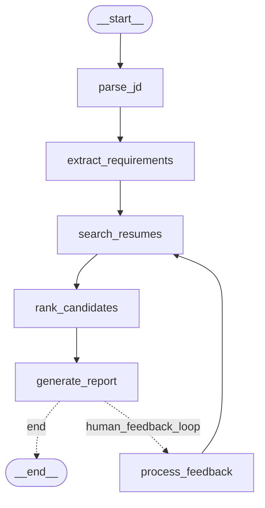
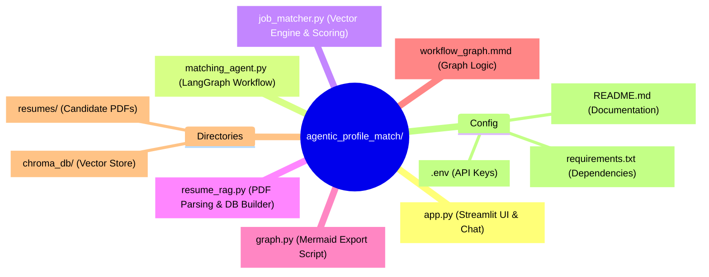

# 🤖 Agentic Candidate Matching & Screening System

An intelligent, multi-stage recruitment assistant powered by **LangGraph**, **ChromaDB**, **Streamlit**, and **OpenAI**. The system ingests PDF candidate resumes into a persistent vector database, executes dynamic hybrid searches against job descriptions, and provides an interactive conversational interface for candidate screening, comparison, and criteria adjustment.

---

## 🌟 Key Features

* **Automatic PDF Ingestion**: Auto-indexes resumes from `./resumes/` into ChromaDB on startup.
* **Flexible JD Input**: Supports manual text entry, `.txt`/`.pdf`/`.md` file uploads, or direct local file system paths (`file_sys_assist`).
* **Hybrid Vector & Skill Matching**: Blends dense semantic vector retrieval (L2/Cosine distance) with rule-based skill bonus scoring.
* **LangGraph Pipeline Execution**: Structured, multi-node agent workflow for initial parsing, extraction, retrieval, re-ranking, and report generation.
* **Stateful Conversational Chat**: Enables natural language candidate comparisons, relative rank justifications ("Why did Candidate X beat Candidate Y?"), and multi-round screening (Hire/No-Hire recommendations) with persistent context memory.

---

## 📐 LangGraph Workflow Diagram

The initial screening pipeline follows a deterministic state machine managed by LangGraph:



## 📂 Project Structure



🚀 Quickstart
```Bash
# Clone repository
git clone [https://github.com/YOUR_USERNAME/agentic_profile_match.git](https://github.com/YOUR_USERNAME/agentic_profile_match.git)
cd agentic_profile_match

# Setup environment
python -m venv venv
source venv/bin/activate
pip install -r requirements.txt

# Add OPENAI_API_KEY to .env
echo "OPENAI_API_KEY=your_key_here" > .env

# Run Streamlit Application
streamlit run app.py
```